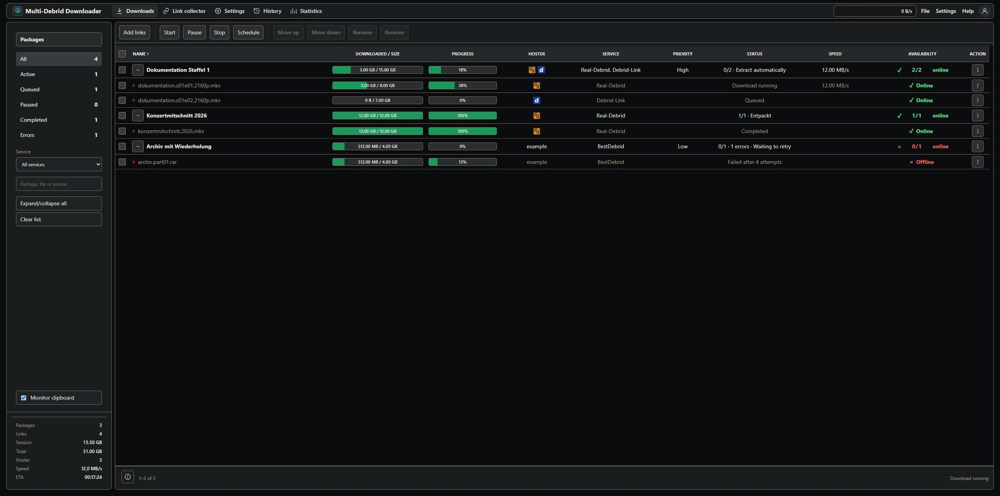

# Multi-Debrid Downloader

Fast package-based downloading for Windows with multiple debrid services, automatic fallback, link availability checks, extraction, queue recovery, history, statistics, and built-in updates.

[](https://github.com/Sucukdeluxe/multi-debrid-downloader/releases/latest)
[](https://github.com/Sucukdeluxe/multi-debrid-downloader/releases/latest)
[](https://www.electronjs.org/)
[](LICENSE)



## Overview

Multi-Debrid Downloader combines a desktop download queue with provider routing, package management, automatic extraction, and persistent recovery. Add direct hoster links, organize them into packages, choose your debrid accounts, and let the application handle retries, fallback, progress, cleanup, and history.

The interface is available in English and German. New installations start in English, and the language can be changed immediately without restarting the application.

## Download

The latest Windows release is available on the [GitHub Releases page](https://github.com/Sucukdeluxe/multi-debrid-downloader/releases/latest).

| Package | Recommended for |
| --- | --- |
| `Real-Debrid-Downloader-Setup-<version>.exe` | Normal installation with Start menu and optional desktop shortcut |
| `Real-Debrid-Downloader-<version>-portable.exe` | Portable use without installation |
| `SHA256SUMS.txt` | Verifying downloaded files |

Windows 10 or Windows 11 is required. Release executables are currently unsigned, so Windows may show a SmartScreen warning on first launch.

## Highlights

- Virtualized package queue with expandable file rows, search, filters, bulk selection, Shift range selection, and keyboard clearing with Escape.
- RapidGator availability and file-size discovery before a download starts.
- Package totals calculated from known link sizes and updated while links are checked.
- Multi-account provider routing with configurable priority, hoster overrides, traffic limits, and automatic fallback.
- Resumable parallel downloads, retries, reconnect handling, schedules, bandwidth limits, and live speed history.
- Automatic extraction with nested archives, password reuse, conflict handling, disk-space checks, and optional cleanup.
- Persistent sessions, history, all-time statistics, queue backup import/export, and recovery after restart.
- English and German interface with localized dialogs, statuses, menus, settings, and update information.
- Built-in GitHub update checks with release changelogs and installer download support.

## Supported services

| Service | Access modes |
| --- | --- |
| Real-Debrid | API token |
| AllDebrid | API token, browser login |
| BestDebrid | API token, cookie import |
| Debrid-Link | Multiple API keys |
| Mega-Debrid | API, web login |
| LinkSnappy | Account login |
| DDownload | Account login |
| 1fichier | API key |

Provider availability and supported hosters can change independently of the application. A valid account for at least one configured service is required for debrid downloads.

## Download queue

The Downloads workspace is optimized for large queues:

- Compact package and file rows with progress, downloaded size, total size, hoster, service, priority, status, speed, and availability.
- RapidGator and DDownload hoster icons with full names in tooltips.
- Online counters for packages and clear online, partial, checking, and offline states.
- Drag-reorderable columns with a smooth full-column preview and persisted layout.
- Green progress indicators, animated package expansion, and clear selected-row highlighting.
- Context menus for package and file actions without redundant activation controls.
- Start, pause, stop, schedule, reorder, rename, remove, enable, disable, reset, and retry actions.
- Animated summary values for packages, links, session bytes, queue size, and hoster count.

## Link collector

- Paste one or many supported links into collections before adding them to the queue.
- Import structured text exports, JSON queue backups, and DLC containers.
- Drop plain links or supported files directly into the application.
- Monitor the clipboard with an immediate, persistent toggle.
- Preserve package and optional file names when exporting and re-importing selected links.

## Accounts and routing

- Manage several accounts or API keys for the same provider.
- Enable or disable individual accounts without deleting their saved data.
- Apply account changes to active queues without restarting the application and continue with the next usable account when an attempt fails.
- Check account status, remaining traffic, username, expiry, and access type.
- Configure primary, secondary, and tertiary provider fallback.
- Route individual hosters through a specific provider.
- Apply daily provider limits and per-key Debrid-Link limits.
- Keep passwords, API keys, cookies, and tokens masked in the interface.

## Download engine

- Parallel downloads with configurable concurrency.
- Resume support when the source and provider allow ranged requests.
- Automatic retries with cooldown and reconnect handling.
- Global or per-download speed limits and time-based bandwidth schedules.
- Package speed, ETA, progress, and live bandwidth statistics.
- Duplicate handling with keep, skip, or overwrite choices.
- Optional scheduled queue start and automatic resume after restart.

## Extraction and cleanup

- Automatic RAR, ZIP, and 7z extraction after download.
- Nested archive extraction and package-scoped password reuse.
- Conflict policies for overwrite, skip, rename, or confirmation.
- Disk-space validation before extraction.
- Optional archive, link-artifact, and sample-file cleanup.
- Optional flat MKV collection after a package completes.
- Extraction recovery after restart and optional extraction while downloads are stopped.

## History and statistics

- Filterable history with completed, failed, removed, and active outcomes.
- Package details including provider, target folder, size, duration, and completion state.
- Session, daily, seven-day, 30-day, and all-time statistics.
- Persistent all-time counters and bandwidth history.
- Localized status colors and consistent table actions.

## Settings and updates

- Immediate English/German language switching.
- Dark, light, and system theme options.
- Configurable download folder, queue behavior, history retention, notifications, extraction, cleanup, and bandwidth.
- GitHub update checks with localized release notes and download actions.
- Backup export/import for settings and optional queue data.
- Optional minimize-to-tray and desktop notifications.

## Getting started

1. Download the installer or portable executable from [Releases](https://github.com/Sucukdeluxe/multi-debrid-downloader/releases/latest).
2. Open **Settings → Accounts** and add at least one supported debrid account.
3. Configure provider order and optional hoster routing under **Usage rules**.
4. Add links from **Downloads** or prepare collections in **Link collector**.
5. Review package names, destination, extraction, and cleanup settings.
6. Start the queue.

## Link export format

Selected packages or files can be exported as structured text and imported again without losing package grouping.

```text
# rd-link-export: 1
# package: Example Series S01
# file: Example.Series.S01E01.part1.rar
https://example.com/file-1
# file: Example.Series.S01E01.part2.rar
https://example.com/file-2
```

## Build from source

Requirements:

- Node.js 20 or newer
- npm
- Windows 10 or Windows 11 for release packaging
- Optional Java Runtime 8 or newer for the JVM extraction backend

```powershell
npm ci
npm test
npm run dev
```

Create the Windows installer and portable executable:

```powershell
npm run release:win
```

Useful commands:

| Command | Description |
| --- | --- |
| `npm run dev` | Start the main-process watcher, Vite renderer, and Electron |
| `npm test` | Run client and backup API tests |
| `npm run self-check` | Run the integrated application self-check |
| `npm run build` | Build the main and renderer bundles |
| `npm run release:win` | Build the Windows installer and portable executable |
| `npm run verify:release` | Verify release metadata and packaged redistribution files |

## Project structure

```text
src/main                 Electron main process and download engine
src/preload              Secure IPC bridge
src/renderer             React interface
src/shared               Shared types and contracts
resources/extractor-jvm  Optional extraction runtime
services/backup-api      Backup API service
scripts                  Build and release verification tools
tests                    Unit and integration tests
```

## Data, privacy, and diagnostics

Configuration, credentials, queue state, history, and logs are stored locally in Electron's `userData` directory. Secrets are not included in public source or release archives. Provider credentials are only sent to the configured provider endpoints required for account and download operations.

The application can generate a bounded support bundle that correlates account rotation, link conversion, download recovery, disk waiting, queue controls, and export phases with anonymous identifiers. Credentials, copied content, URLs, hostnames, local paths, package names, and filenames are redacted before diagnostic data is persisted and again when the archive is built.

An optional authenticated local debug API is also available. Remote access is disabled by default. Do not expose diagnostic endpoints publicly without a firewall, VPN, or reverse proxy, and always use a strong unique token.

## Updates and changelog

See [CHANGELOG.md](CHANGELOG.md) for the complete release history. The application also displays the current GitHub release notes when an update is available.

## License

Multi-Debrid Downloader is released under the [MIT License](LICENSE). Third-party notices are listed in [THIRD_PARTY_NOTICES.md](THIRD_PARTY_NOTICES.md).
